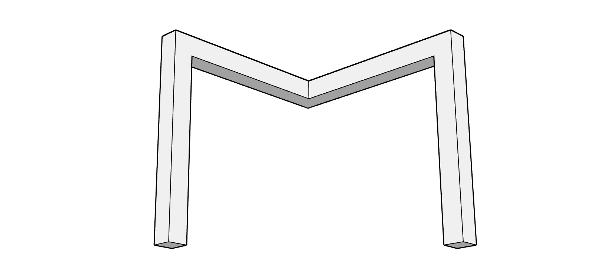
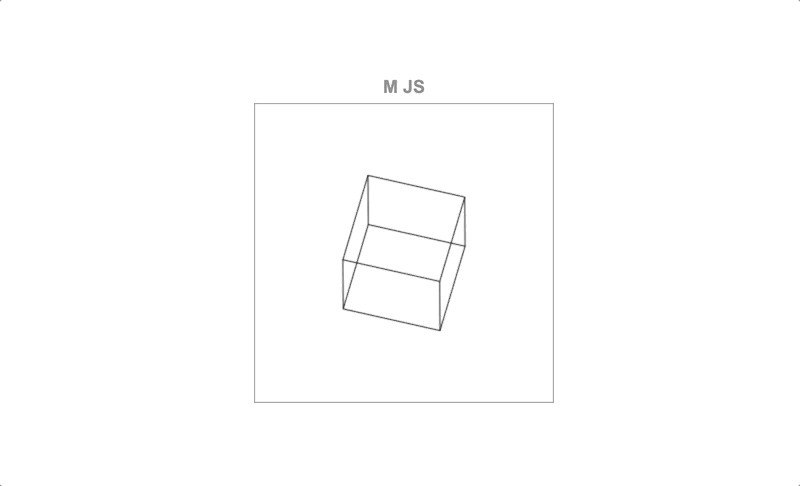

# **M JS**

3D math operations in JavaScript.

## Install

In the browser just load the file `m.js` in a `script` tag at the bottom of its `body`.

```html
<body>
    ...
    <script src="m.js">
    <!-- your scripts using m.js here -->
</body>
```

In node just install the package `m.js` and require (or import) it in your module.

```sh
$ npm i m.js
```

```js
var M = require('m.js');

// or import it (e.g. in React, Vue... whatever)
import M from 'm.js';
```

## Use

Demo code:

```js
// define a matrix where to locate the vertices of a cube
var cube = [
    [],
    []
];

// define the length of the sides
var side = 100;

// define the vertices from one side
cube[0].push(M.p(0, 0, 0));
cube[0].push(M.p(0, side, 0));
cube[0].push(M.p(side, side, 0));
cube[0].push(M.p(side, 0, 0));

// define the vertices from the opposite side
cube[1].push(M.p(0, 0, side));
cube[1].push(M.p(0, side, side));
cube[1].push(M.p(side, side, side));
cube[1].push(M.p(side, 0, side));

for (var i in cube) {
    // translate the cube to locate its reference point (0, 0, 0) to its center
    M.t(cube[i], -side / 2, -side / 2, -side / 2);

    // rotate the cube a bit in z and x axis
    M.rzd(cube[i], 55);
    M.rxd(cube[i], 60);
}

// next render the geometry ...
```



**SEE** animated demo `cube-3d.js` by running `index.html` in the browser.